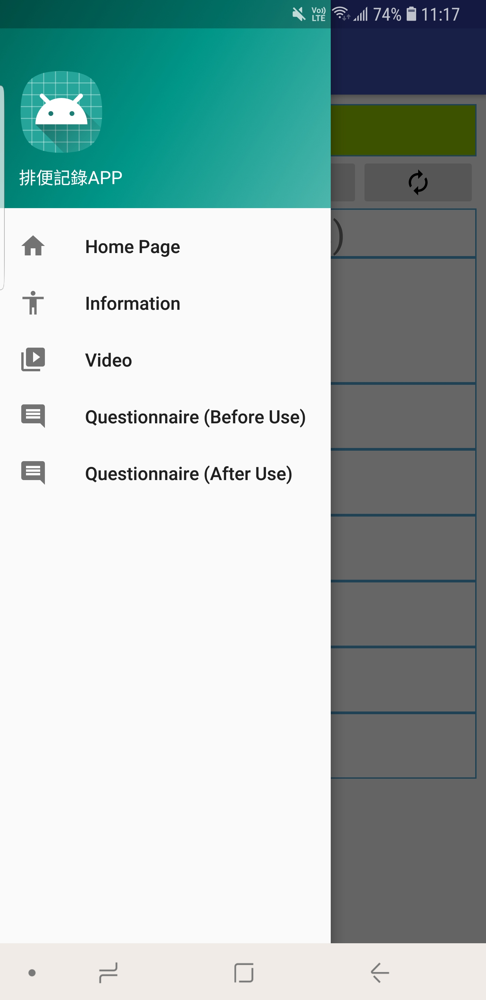

# IA Project

### Project Background & Description
A group a Health Studies students want an Android Application to record the bowel habit of user and how it changes before and after having exercise. Also, they would like to compare the result of before and after using the Application. Therefore, we are asked to develop the application. It provides different functions, like collect questionnaire, add record, display useful information and play video. 

---

### Questionnaire
<table>
  <tr>
    <td>
      Chinese Version
      
    </td>
    <td>
      English Version
      
    </td>
  </tr>
</table>
The questionnaire consists of two part: one is before use, which will be displayed when the user installs the app for the first time. Another one is after use; it will be showed after the user had used for one month. Both questionnaires have Chinese and English version.

---

### Main Page

The main page showed the current date and user can click “+” button to add new record. User can also trace back the previous records.

---

### Add Record

When adding a record, user need to input some information, like the time, the color, the shapes, the size and whether the user did exercise. There is pop-up menu for user to choose their options and the corresponding pictures will be displayed.

---

### Side Bar

The side bar is used to help user to navigate to different pages.

---

### YouTube Video

When user clicks “Video”, it will bring the user to the YouTube app and play the video about exercises that improve bowel habit.
